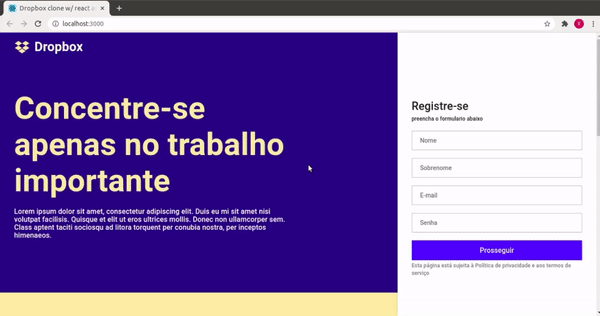

# Clone Dropbox homepage

Read this document in: [English](README.en.md)

# About this repo

This repository contains two versions, [cdh-v0](./cdh-v0/README.md) (clone dropbox homepage version 0) a version in which I did accompanying this [class](https://www.youtube.com/watch?v=VqP1ECc_j4M), and [cdh-v1](./cdh-v1/README.md) (clone dropbox homepage version 1) in wich I did an adaptation for the libary (or UI framework) material-ui.

##### See also the [official repository](https://github.com/rocketseat-content/youtube-clone-dropbox-menu)

### Contributors

[@TiagoRCunha](https://github.com/TiagoRCunha/)
