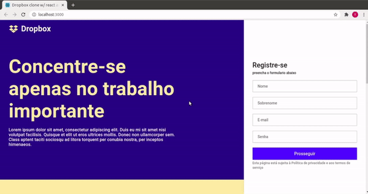

# Clone Dropbox homepage

Leia este documento em: [English](README.en.md)

# Sobre este repositório

Este repositório contém duas versões, [cdh-v0](./cdh-v0/README.md) (clone dropbox homepage versão 0) uma versão na qual eu fiz acompanhando a esta [aula](https://www.youtube.com/watch?v=VqP1ECc_j4M), e [cdh-v1](./cdh-v1/README.md) (clone dropbox homepage versão 1) na qual eu fiz uma adaptação para a biblioteca (ou UI framework) material-ui.

##### veja também o [repositório oficial](https://github.com/rocketseat-content/youtube-clone-dropbox-menu)

### Contribuidores

[@TiagoRCunha](https://github.com/TiagoRCunha/)
