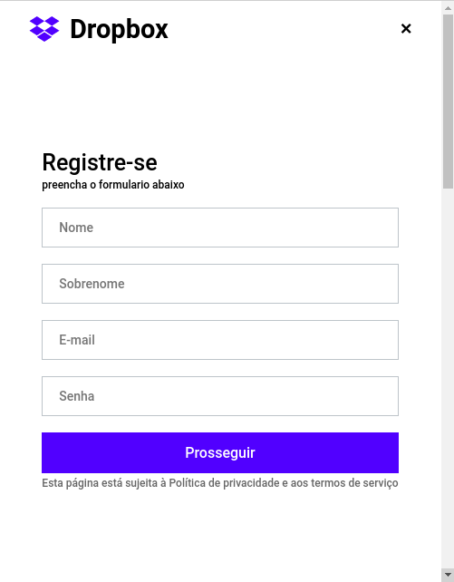

## About this version

This version is the same of this rocketseat's [vídeo](https://www.youtube.com/watch?v=VqP1ECc_j4M).

Read this document in: [Português](README.md)

## Notes

- See also the [official repository](https://github.com/rocketseat-content/youtube-clone-dropbox-menu)
- In the component `SideMenu` the property `@media (min-width: 1024px)` of the component `Container` was repeated :blush:

## Techs

- [x] React.js
- [x] Styled Components
- [x] TypeScript

## Init the project

Install the dependencies:

```
yarn

or

npm install
```

Init the project in development mode:

```
yarn start

or

npm start
```

## Prints

### On Desktop


### On mobile


### On mobile side menu


