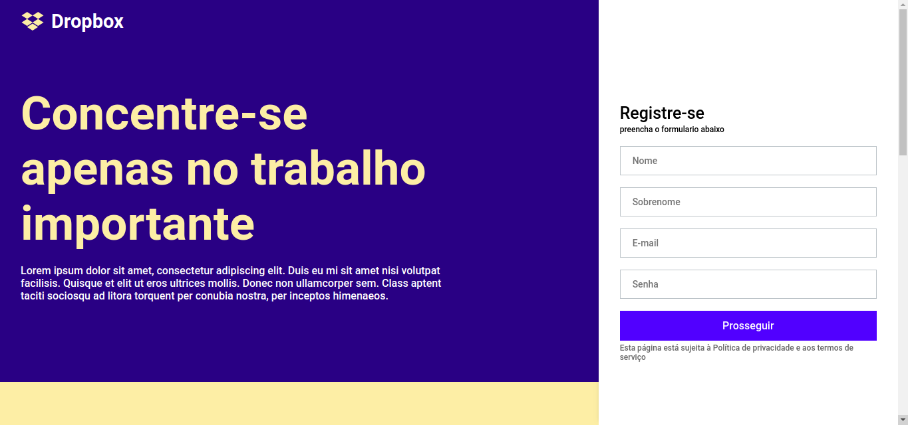
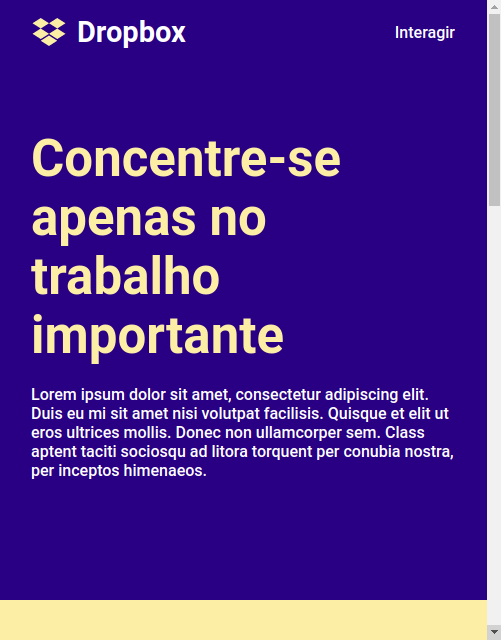
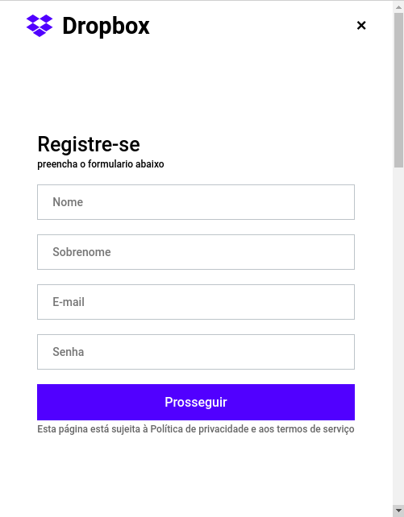

## Sobre esta versão

Esta versão é a mesma deste [vídeo](https://www.youtube.com/watch?v=VqP1ECc_j4M) da rocketseat.

Leia este documento em inglês: [English](README.en.md)

## Observações

- Veja também o [Repositório oficial](https://github.com/rocketseat-content/youtube-clone-dropbox-menu)
- No componente `SideMenu` a propriedade `@media (min-width: 1024px)` do componente `Container` estava repetida :blush:

## Tecnologias

- [x] React.js
- [x] Styled Components
- [x] TypeScript

## Iniciar o projeto

Instale as dependencias:

```
yarn

ou

npm install
```

Iniciar o projeto em modo de desenvolvimento:

```
yarn start

ou

npm start
```

## Prints

### Visão desktop



### Visão mobile



### Visão mobile do menu lateral


