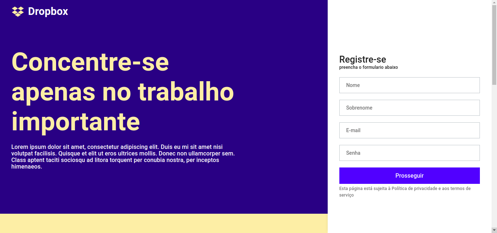
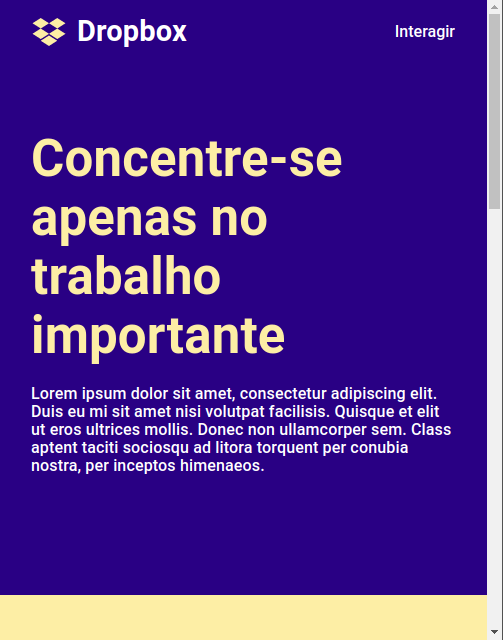
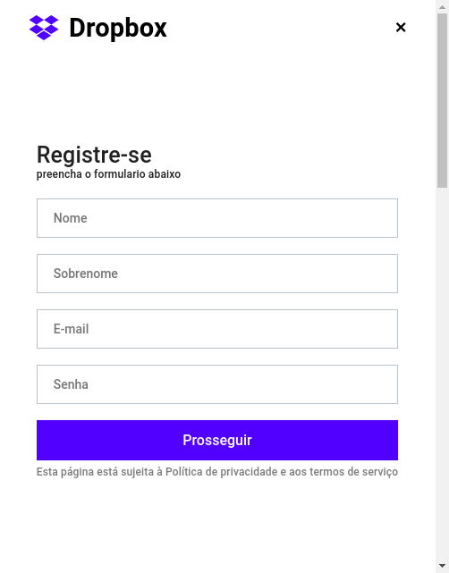

## About this version

It is an adaptation of this rocketseat's [vídeo](https://www.youtube.com/watch?v=VqP1ECc_j4M) about the clone of [dropbox homepage](https://www.dropbox.com/pt_BR/).
This adaptation uses the library [material-ui](https://material-ui.com/) instead of [styled-component](https://styled-components.com/).

Read this document in: [Português](README.md)

## Notes

- The material-ui method used `styled()` is based on the library styled-component
- This adaptation follow to the letter the video's styles, so somes material-ui default styles was modified just for this purpose.

## Techs

- [x] React.js
- [x] Styled Components
- [x] TypeScript

## Init the project

Install the dependencies:

```
yarn

or

npm install
```

Init the project in development mode:

```
yarn start

or

npm start
```

## Prints

### On Desktop



### On mobile



### On mobile side menu


