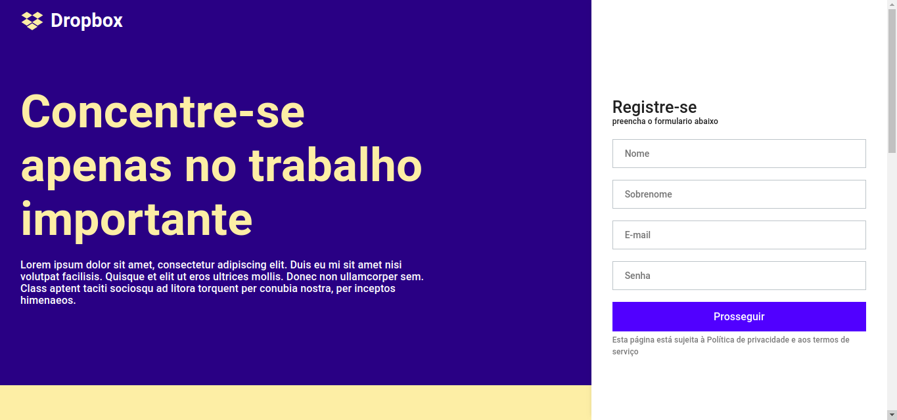

## Sobre esta versão

É uma adaptação deste [vídeo](https://www.youtube.com/watch?v=VqP1ECc_j4M) da rocketseat sobre o clone da [homepage da dropbox](https://www.dropbox.com/pt_BR/).
Esta adaptação utiliza a biblioteca [material-ui](https://material-ui.com/) ao invés da biblioteca [styled-component](https://styled-components.com/).

Leia este documento em inglês: [English](README.en.md)

#### Observações

- O método utilizado `styled()` do material-ui é baseado na biblioteca styled-component
- Esta adaptação segue a risca os estilos do vídeo, então alguns estilos padrão do material-ui foi modificado apenas para este propósito.

## Tecnologias

- [x] React.js
- [x] Styled Components
- [x] TypeScript

## Iniciar o projeto

Instale as dependencias:

```
yarn

ou

npm install
```

Iniciar o projeto em modo de desenvolvimento:

```
yarn start

ou

npm start
```

## Prints

### Visão desktop



### Visão mobile


### Visão mobile do menu lateral


